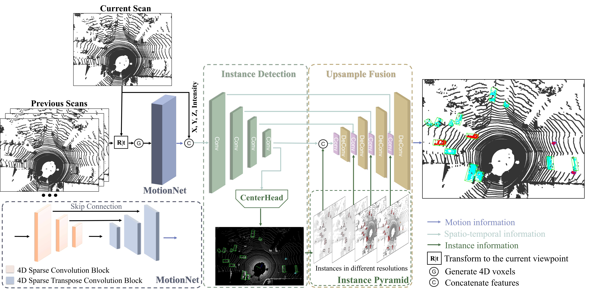

# InsMOS: Instance-Aware Moving Object Segmentation in LiDAR Data

This repository contains the implementation of our paper:

> **InsMOS: Instance-Aware Moving Object Segmentation in LiDAR Data** [[pdf](https://arxiv.org/abs/2303.03909)]\
> [Neng Wang](https://github.com/neng-wang),  [Chenghao Shi](https://github.com/chenghao-shi),  Ruibin Guo,  Huimin Lu,  Zhiqiang Zheng,  [Xieyuanli Chen](https://github.com/Chen-Xieyuanli)   
> If you use our code in your work, please star our repo and cite our paper.

```
@article{wang2023arxiv,
	title={{InsMOS: Instance-Aware Moving Object Segmentation in LiDAR Data}},
	author={Wang, Neng and Shi, Chenghao and Guo, Ruibin and Lu, Huimin and Zheng, Zhiqiang and Chen, Xieyuanli},
	journal={arXiv preprint},
	doi = {10.48550/ARXIV.2303.03909},
	volume  = {2303.03909},
	year={2023}
}
```

<div align=center>
 
</div>

- *Our instance-aware moving object segmentation on the SemanticKITTI sequence 08 and 20, 21.*

- *Red points indicate predicted moving points, cyan indicate predicted static instance points and gray points are static background.*

- *Green bounding boxes represent cars, blue bounding boxes represent pedestrians, and yellow bounding boxes represent cyclists.*

## Overview



**Overview of our network.** The network is composed of three main components:

- MotionNet mainly extracts motion features.  

- Instance Detection Module extracts spatio-temporal features and detects instances. 

- Upsample Fusion Module is applied to fuse the spatio-temporal and instance features, and predict point-wise moving confidence scores.

## Data

1、SemanticKITTI: Download SemanticKITTI dataset from the official [website](http://semantic-kitti.org/). 

2、KITTI-road Dataset: Download the KITTI-road Velodyne point clouds from the official [website](https://www.cvlibs.net/datasets/kitti/raw_data.php?type=road) and MOS label from [MotionSeg3D](https://github.com/haomo-ai/MotionSeg3D).

3、Instance label: [coming soon].

## Code

The code and usage details will be available soon.

## Contact

Any question or suggestions are welcome!

Neng Wang: nwang@nudt.edu.cn and Xieyuanli Chen: xieyuanli.chen@nudt.edu.cn

## License

This project is free software made available under the MIT License. For details see the LICENSE file.

